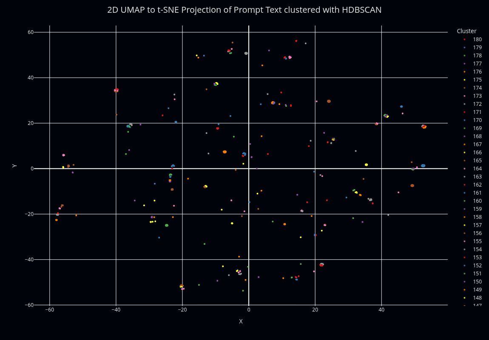
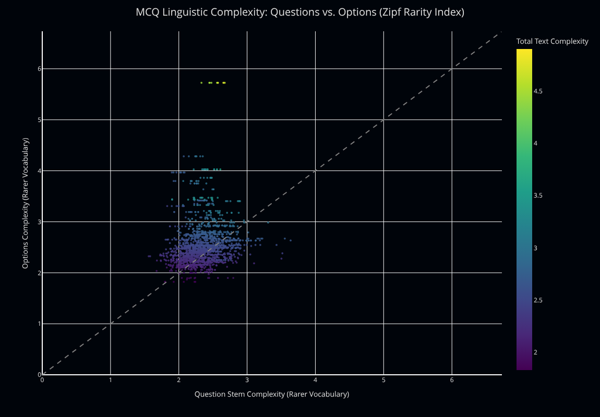
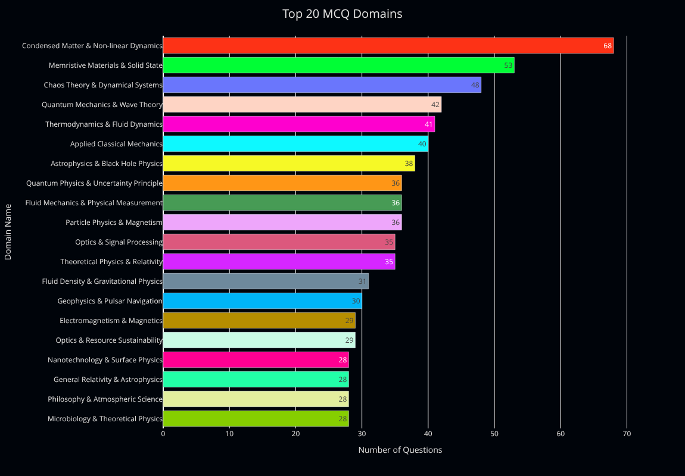
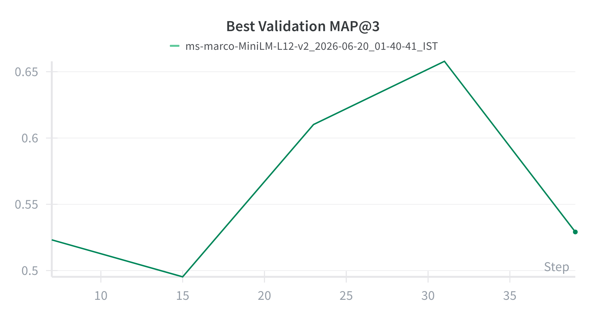
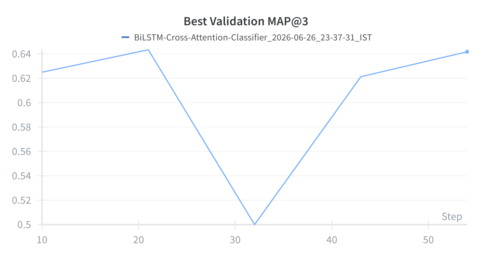

# Smart MCQ Solver with Deep Learning

Introduction to Deep Learning and Generative AI Project, May 2026

Spandanjit Mondal

## 1. Abstract

This report covers the work for the `Smart MCQ Solver Challenge` Kaggle competition where the main objective was to build AI systems that solve & predict and rank the top 3 most likely correct options for challenging multiple choice questions.

Four different kinds of models were used in this competition, ranging from simple LSTM models with Cross Attention, to fine-tuned cross encoder models like `ms-marco-MiniLM-L12-V2` and `zerank-2-reranker`, to a bespoke Retrieval Augmented Generation (RAG) pipeline using the `Qwen` family of models. The 8-bit quantized LoRA fine-tuned `zerank-2-reranker` gave the best results with a Mean Average Precision (`MAP@3`) of approximately 0.76 on the test set.

The main challenges of this project were the limited unique training samples, and the widespread data leakage between the train and test data, which made it difficult to reliably judge solutions.

This report describes the full pipeline of the project, along with design decisions, and areas of improvement that can be addressed with more time, and better hardware availability.

## 2. Introduction

### 2.1 Problem Statement

The competition asked participants to predict the top 3 options, and rank them from most to least likely to be correct for each question, given the question and 5 options. The evaluation criteria is `Mean Average Precision @3`, or `MAP@3`. There are approximately 180 unique questions in the dataset, and the rest are minor variations of these samples, augmented to be semantically similar.

### 2.2 Project Objective

The primary goal in this project was to be in the top 100 in the public leaderboard, and cross 0.76 on the test set. My final `public leaderboard MAP@`3 is `0.76184` with a `rank` of `125`.

The secondary objectives included getting familiar with RAG pipelines: understanding steps of the pipeline from data collection to building the vector database, and then retrieval, reranking, and generation of the correct answer; along with building a fast and efficient pipeline to run on free-tier Kaggle hardware with `2x T4 GPU`s at `30GB total VRAM`.

### 2.3 Report Structure

This report is structured as follows:

- Section 3 describes the dataset, preprocessing, and data analysis steps covered in the project
- Section 4 describes the tokenization strategy used for the various models
- Section 5 describes the different models and model architectures used
- Section 6 compares model performances and trade-offs of each approach
- Section 7 reflects on learnings, challenges, and future improvements

## 3. Dataset & Preprocessing

### 3.1 Dataset Description

- `train.csv` has 2000 samples, each with the features: `id`, `prompt` (this feature is the question text for the MCQ), options like `A`, `B`, `C`, `D`, `E` (these features are the option texts for the MCQ), and `answer` (this feature contained the option label of the correct option from A to E.
- `test.csv` has 500 samples with the same features as the train dataset, except for the `answer` feature.

### 3.2 Exploratory Data Analysis

The dataset consists of approximately 180 unique sets of questions and options.



According to the Inverted Zipf frequency, most of the options seem to be slightly more complex than their corresponding questions, although this could be explained by the sets of questions where the data to be ranked is present in the option texts.



The questions span a wide variety of topics from Astrophysics, Classical Physics, and Quantum Physics to Astrochemistry, Biology, and Philosophy.



### 3.3 Data Preprocessing\

A column `mcq_query` was created by concatenating the `prompt` and option columns from `A` to `E` for clustering to be used in `GroupKFold` for the later notebooks (`train-c.ipynb` & `train-d.ipynb`), whereas it was done only on the prompt texts in the first two notebooks. Clustering using `mcq_query` was also done for evaluating the RAG pipeline.

For the initial baseline model coded from scratch, clustering was done on the `prompt` column using a `TfidfVectorizer` with the following parameters:

```python
ngram_range=(1, 3), max_df=0.99, min_df=2, strip_accents="unicode", sublinear_tf=True
```

Followed by `TruncatedSVD` with the following parameters:

```python
n_components=384, random_state=42
```

The text for this type of clustering was manually cleaned by removing HTML tags, URLs, emojis and non-ASCII characters, numbers, special characters, and extra spaces.

There are no missing values in the entire dataset.

## 4. Tokenization Strategy

### 4.1 Primary Tokenizer Selection

The best performing model in this project is a fine-tuned `zerank-2-reranker` from `zeroentropy`, loaded via `SentenceTransformer`’s `CrossEncoder` library. Since this model is a fine-tuned `Qwen3-4B` model, it uses a byte-level `Byte Pair Encoding` (`BPE`) tokenizer inherited from `Qwen` tokenizer family.

`BPE` strikes an effective balance between character-level and word-level tokenization. `BPE` breaks down rare, technical, or out-of-vocabulary words without an `“unknown token”` fallback ensuring reliable semantic matching across the diverse domains the model was trained on. In a cross-encoder reranker, tokenizing the concatenated query + document pair correctly is critical.

### 4.2 Implementation Details

For `SentenceTransformer` and `CrossEncoder` models, tokenizers were instantiated automatically by `HuggingFace`’s `AutoTokenizer` module. These models internally call `AutoTokenizer.from_pretrained()` to get the correct `BPE`/`WordPiece` tokenizers. Batching is done automatically using a batch size of 16. The tokenizers apply dynamic padding to pad sequences to the length of the longest token array in the current batch rather than to the model’s maximum context window. The tokenizer pipeline is configured to preserve query tokens, and truncate the tail end of the documents (or options).

### 4.3 Experimental Comparison

This project has implemented four distinct models and their corresponding tokenizers. Here’s a summary of the tokenizers I experimented with:

- `WordPiece` for `ms-marco-MiniLM-L12-V2`
- A custom made `BPETokenizer` for `BiLSTMCrossAttentionClassifier`
- `Qwen`’s `BPETokenizer` for `Qwen3-Embedding-4B`, `Qwen3-Reranker-8B`, and `Qwen2.5-14B-Instruct` in the RAG pipeline, and for `zerank-2-reranker`

## 5. Modelling & Experimentation

### 5.1 Fine-tuned Transformer Model ([ms-marco-MiniLM-L12-V2](https://huggingface.co/cross-encoder/ms-marco-MiniLM-L12-v2))

#### Model 1 Architecture

The selected model utilizes `ms-marco-MiniLM-L12-V2`, a `BERT` architecture (~33.4M parameters) model. It is a fine-tune of `Microsoft`’s `MiniLM-L12-H384-uncased`, a general purpose distilled `BERT`.

#### Model 1 Salient Points

`MiniLM` is a distilled version of `BERT` released by `Microsoft` that retains the same encoder only, multi-head self-attention. Since the specific task for the project requires the model to jointly score prompt & option pairs, cross-encoders excel here because the attention operates jointly over both texts, in contrast to bi-encoders where they’re scored independently.

#### Model 1 Fine-tuning Strategy

- Optimizer, LR, & LR Schedule: AdamW with 2e-5 and no LR Scheduler
- Loss Function: CrossEntropyLoss
- Epochs & N Folds: 7 epochs with 5 split CV
- Batch Size: Effective batch size of 32 with per device batch size of 8, and 4 gradient accumulation steps
- Frozen Layers: None

Full fine-tuning was performed on this model, with a correspondingly low constant learning rate of 0.00002. Full fine-tuning of small transformer models requires a very low learning rate to prevent catastrophic forgetting.

It was fine-tuned on 5 split GroupKFold using UMAP + HDBSCAN cluster based grouping to avoid data leakage between the train and validation splits.

No quantization was used as the small model (~33M parameters) fits comfortably within a single T4 GPU’s VRAM (15GB). Avoiding quantization also has the added benefit of preserving full fine-tuning precision.

### 5.2 Custom BiLSTM Cross-Attention Classifier

#### Model 2 Architecture

The custom model is a BiLSTM Cross-Attention Classifier that encodes the prompt and options using a shared bidirectional LSTM encoder, then applies a custom scaled dot-product cross-attention mechanism to let each option attend over the full prompt context before fusing and scoring.


#### Model 2 Salient Points

- The BiLSTM captures contextual information within the prompt and each option in both directions which matters for this dataset where options can subtly differ compared to others depending on words appearing late in the context.
- The cross-attention layer lets every option dynamically get the most relevant parts of the prompt into its own representation.
- Concatenating the option representation, attention-derived prompt context, and their element-wise product preserves both standalone information and feature-level agreement.
- Dropout & BatchNorm1D in the classification head stabilize activations across batches due to the models’ small vocabulary and dataset size.
- Model and training hyperparameters were selected using Optuna with TPESampler.

### 5.3 RAG Pipeline

#### Model 3 Architecture

The RAG pipeline follows a three-stage dense retrieval -> cross-encoder reranking -> option scoring design. A knowledge base was prepared from documents collected from `arXiv`, `PubMed`, `Wikipedia`, `HuggingFace`, and `Kaggle`. During indexing, documents were chunked with `Chonkie`’s `SentenceChunker`, using Qwen’s BPE tokenizer with `chunk_size=512` and `chunk_overlap=128`.

The chunks were embedded with `Qwen3-Embedding-4B` and stored in a persistent `ChromaDB` collection. The database was then packaged as a Kaggle dataset and loaded by the inference notebook. The database was created using the following configuration:

```python
"hnsw:space": "cosine", "hnsw:M": 64, "hnsw:construction_ef": 256, "hnsw:search_ef": 128, "hnsw:batch_size": 128
```

The test data was then serialized to include the `mcq_query` column which was used to compute the embeddings using `Qwen3-Embedding-4B` to get the embeddings for retrieval. For each query, `ChromaDB` retrieves the top 10 unique documents which were returned by the pipeline. These documents were then ranked by `Qwen3-Reranker-8B`, and the five highest scoring documents were retained as context for the final stage.

Finally, the five reranked documents, original question, and all available options were provided to `Qwen2.5-14B-Instruct`. Rather than generating a response and parsing it, the pipeline directly extracted the final-position vocabulary logits and selected the logits associated with the five option-label tokens. The options were ranked in descending logit order, and the three highest-ranked labels formed the RAG’s prediction.

#### Model 3 Salient Points

- The embedding model was loaded in `FP16`, and the resulting query embeddings were converted to `float32` before being used for retrieval. The reranker & the SLM were loaded with 8-bit quantization using `BitsAndBytesConfig(load_in_8bit=True)`.
- During inference, the models were first loaded, then after the required operations were performed (retrieving & ranking), the results were saved as intermediate files to the disk, and the models were deleted, and their cuda cache cleared. The reranker worked in 2 separate parallel processes to best take advantage of the 2x T4 GPUs provided by Kaggle.
- The embedding, reranker, and SLM were all supplied with custom instructions during inference. Instead of prompting the SLM to generate ranked option texts, the options were retrieved by logit based option ranking. The model received all five options at once and calculated:

```python
logits = model(**enc).logits[:, -1, :]
option_token_ids = [token_id_A, token_id_B, token_id_C, token_id_D, token_id_E] 
option_logits = logits[:, option_token_ids]
```

### 5.4 Fine-tuned Transformer Model ([zerank-2-reranker](https://huggingface.co/zeroentropy/zerank-2-reranker))

#### Model 4 Architecture

`zerank-2-reranker` is derived from the `Qwen3-4B` model. The model has a maximum context length of 32,768 tokens, and was further fine-tuned using `8-bit LoRA` on the training dataset.

For the task of this particular project, each multiple choice sample is represented as one query (`prompt`) and five option documents (options from `A` to `E`). The training labels are listwise relevance scores where the correct option receives `1.0`, while the four incorrect ones receive `0.0`.

#### Model 4 Salient Points

- A custom instruction directs the reranker to assess whether the candidate is the factually correct answer, rather than rely on lexical overlap.
- The model uses `ADRMSELoss` (Approximate Discounted Rank Mean Squared Error) for fine-tuning.
- `LoRA` updates a small set of trainable parameters instead of the full 4B parameters. This keeps domain adaptation computationally feasible, while retaining the broad linguistic and ranking knowledge present in the model’s frozen weights.

#### Model 4 Fine-tuning Strategy

- Optimizer, LR & Weight Decay: Default `AdamW` with 2e-4 & 0.01 weight decay
Loss Function & Dropout: `ADRMSELoss` & 0.1 dropout
- Epochs & N Folds: 3 epochs with 5 split CV
- Batch Size: Effective batch size of 64 with per device batch size of 8, and 8 gradient accumulation steps
- Frozen Layers: Base model layers
- Fine-tuning method: `8-bit LoRA`
- LoRA rank & alpha: 8 rank with 16 alpha
- Target Modules: `q_proj`, `k_proj`, `v_proj`, `o_proj`, `gate_proj`, `up_proj`, `down_proj`

Five split `GroupKFold` was used using `UMAP` + `HDBSCAN` using embeddings from `Qwen3-Embedding-0.6B` to prevent data leakage between the training and validation splits.

The original `zerank-2-reranker` backbone parameters were prepared for `k-bit training` and retained as quantized base weights. The model was adapted through trainable `LoRA` adapters inserted into the attention-projection and MLP projection layers. Thus, the backbone was effectively frozen while only the low-rank adapter parameters were updated.

#### Model 4 Quantization

The base model was loaded with 8-bit quantization using `BitsAndBytesConfig(load_in_8bit=True)`. The quantized model was then prepared for k-bit adapter training using the following code:

```python
prepare_model_for_kbit_training(model.transformers_model)
model.add_adapter(peft_config)
```

where `peft_config` defines the `LoraConfig` object. Loading the model with 8-bit quantization saves memory, while providing almost the full accuracy of loading it in float16.

## 6. Performance & Comparative Analysis

### 6.1 Evaluation Metrics

The primary evaluation metric in this project was Mean Average Precision@3 (MAP@3). Each question sample has one correct answer, while the model submits an ordered list of three predicted option labels. For a single question sample , the score depends on the rank  of the correct option within the top-3 predictions:

$$\text{AP}@3_i = \begin{cases}
1, & r_i = 1 \\
0.5, & r_i = 2 \\
0.33, & r_i = 3 \\
0, & r_i > 3
\end{cases}$$

The final score is the mean over all  samples:

$$\text{MAP}@3 = \frac{1}{N} \sum_{i=1}^{N} \text{AP}@3_i$$

Since each sample has exactly one correct answer, MAP@3 is numerically equivalent to MRR@3. The competition uses the name MAP@3, which is retained throughout this report.

### 6.2 Training Performance

All models were trained/fine-tuned using the same process of 5 split `GroupKFold` with the seed set to `42` to keep comparisons fair. The table below summarizes the validation and test results across models used in this project:

| Model Name | Val MAP@3 | Test MAP@3 | Inference Time (s) |
| ----- | :---: | :---: | :---: |
| ms-marco-MiniLM-L12-V2 [fine-tune] | 0.60591667 | 0.73607 | ~14 |
| BiLSTMCrossAttentionClassifier [train] | 0.56508333 | 0.74937 | ~120 |
| RAG Pipeline | N/A | 0.72693 | ~4500 |
| zerank-2-reranker [fine-tune] | 0.8782308 | 0.76184 | ~1320 |




From the validation graphs from W&B, it is evident that although BiLSTM's validation MAP@3 was lower, it outperformed MiniLM on the public leaderboard (0.749 vs 0.736), which was surprising given I did not expect an LSTM-based model to outperform a pre-trained transformer on text classification.

### 6.3 Comparative Report

The fine-tuned `zerank-2-reranker` was the best performing model. Fine-tuning was performed using `8-bit quantization` and `LoRA adapters`. The `LoRA` configuration used rank `r=8`, scaling factor `α=16`, and dropout of `0.1`. Adapters were added to the attention projection layers and MLP projection layers.

The second best performing model was the custom trained `BiLSTMCrossAttentionClassifier` which scored `0.74937` on the public test dataset. Its architecture encodes both prompts and options, then uses cross-attention where the option representations attend to the prompt representations. The model then fuses the pooled option representations, attention-derived option-context representations, and the element wise interactions to provide a relevance score for each option.

The fine-tuned `MiniLM-L12-V2`, and the `RAG pipeline` were the least performant approaches tried, scoring around `0.736` and `0.726` respectively. The lower performance of the `MiniLM` model may be related to the mismatch between the original passage-ranking objective and the multiple-choice option ranking objective of this project.

The RAG’s performance was lower than expected. Although RAGs are generally expected to outperform non-retrieval approaches provided the retrieved context is relevant and well-ranked; however, in this case, the RAG pipeline scored the lowest at ~0.726, below the cutoff score at 0.73. This could be due to a variety of reasons:

- **Data Collection**: The retrieved corpus combined `arXiv`, `PubMed`, `Wikipedia`, `Kaggle`, and `Hugging Face` datasets. The `arXiv` and `PubMed` subsets were collected using keyword based queries generated by a `gemma-4-12B-it` model which likely introduced noisier, less targeted documents compared to the curated `Wikipedia`, `Kaggle`, and `HF` sources. The noise may have reduced the relevance of retrieved context, and in turn, generation quality.
- **Pipeline Model choice**: The `reranking` and `generation` models used were general-purpose rather than fine-tuned on the project’s domain data. Smaller models fine-tuned specifically for the project data could plausibly improve ranking precision and generation quality.

These two factors are not mutually exclusive, and may compound one another, for example: a set of curated retrieved documents could benefit from a fine-tuned reranker/generator to produce results that take into account the document’s relevancy to the question.

### 6.4 Kaggle Performance
The final submission was done using the fine-tuned `zerank-2-reranker`, and scored 0.76184 on the public leaderboard at the 125th position at the time of writing.

## 7. Conclusion & Future Work

### 7.1 Key Learnings

- **Pipeline complexity doesn't automatically translate to performance**: Building the end-to-end RAG pipeline was the most architecturally complex part in this project, yet it had the lowest test MAP@3 (~0.726), and the highest inference cost (~4500 s).
- **Matching objective to task matters more than parameter counts**
- **Cluster-aware cross-validation is essential for augmented datasets**: Using GroupKFold with learned clusters rather than a naive random split was necessary given the dataset’s ~180 unique clusters were heavily augmented to near duplicates.

### 7.2 Challenges Faced

- **Low unique samples**: With only ~180 unique samples, balancing actual learning against overfitting was a constant problem across every model in this project.
- **Train-test leakage**: There was widespread leakage between train and test data which made it difficult to trust MAP@3 difference between models. It pushed design decisions toward exploiting available signal rather than strictly following generalization best practices
- **Hardware constraints**: Fitting a 3-stage RAG pipeline on 2 T4 GPUs with 30GB total VRAM required active memory management: loading and deleting models between stages, clearing CUDA cache, and splitting ranking of documents to utilize the 2 GPUs.

### 7.3 Areas for Improvement

- **Fine-tune RAG pipeline’s own components**
- **Ensemble different top performing models like zerank-2-reranker and BiLSTMCrossAttentionClassifier**
- **Reduce RAG inference cost**: Investigating more aggressive caching of document embeddings, reducing retrieval then ranked document counts, or distilling reranker/SLM into smaller task-specific models.
- **Address data leakage and small sample constraints directly**: Explore stricter cluster level held out test construction, or synthetic question generation with diversity  constraints to build a larger and more reliable unique evaluation set.

## 8. References

- McInnes, L., Healy, J., & Melville, J. (2018). *UMAP: Uniform manifold approximation and projection for dimension reduction* [Preprint]. arXiv. https://doi.org/10.48550/arXiv.1802.03426
- Campello, R. J. G. B., Moulavi, D., & Sander, J. (2013). Density-based clustering based on hierarchical density estimates. In J. Pei, V. S. Tseng, L. Cao, H. Motoda, & G. Xu (Eds.), *Advances in knowledge discovery and data mining* (pp. 160–172). Springer. https://doi.org/10.1007/978-3-642-37456-2_14
- Wang, W., Wei, F., Dong, L., Bao, H., Yang, N., & Zhou, M. (2020). *MiniLM: Deep self-attention distillation for task-agnostic compression of pre-trained transformers*. arXiv. https://doi.org/10.48550/arXiv.2002.10957
- Olah, C. (2015). *Understanding LSTM networks*. Colah’s Blog. https://colah.github.io/posts/2015-08-Understanding-LSTMs/
- Ezen-Can, A. (2020). *A comparison of LSTM and BERT for small corpus*. arXiv. https://doi.org/10.48550/arXiv.2009.05451
- Vaswani, A., Shazeer, N., Parmar, N., Uszkoreit, J., Jones, L., Gomez, A. N., Kaiser, Ł., & Polosukhin, I. (2017). *Attention is all you need* [Preprint]. arXiv. https://doi.org/10.48550/arXiv.1706.03762
- Akiba, T., Sano, S., Yanase, T., Ohta, T., & Koyama, M. (2019). *Optuna: A next-generation hyperparameter optimization framework* [Preprint]. arXiv. https://doi.org/10.48550/arXiv.1907.10902
- Yang, A., Li, A., Yang, B., Zhang, B., Hui, B., Zheng, B., Yu, B., Gao, C., Huang, C., Lv, C., Zheng, C., Liu, D., Zhou, F., Huang, F., Hu, F., Ge, H., Wei, H., Lin, H., Tang, J., … Qiu, Z. (2025). *Qwen3 technical report* [Preprint]. arXiv. https://doi.org/10.48550/arXiv.2505.09388
- Wampler, D., Nielson, D., & Seddighi, A. (2025). Engineering the RAG stack: *A comprehensive review of the architecture and trust frameworks for retrieval-augmented generation systems* [Preprint]. arXiv. https://doi.org/10.48550/arXiv.2601.05264
- Roucher, A. (n.d.). *Advanced RAG on Hugging Face documentation using LangChain*. Hugging Face. https://huggingface.co/learn/cookbook/en/advanced_rag
- Pipitone, N., Houir Alami, G., Avadhanam, A., Kaminskyi, A., & Khoo, A. (2025). *zELO: ELO-inspired training method for rerankers and embedding models*. arXiv. https://doi.org/10.48550/arXiv.2509.12541
- Hu, E. J., Shen, Y., Wallis, P., Allen-Zhu, Z., Li, Y., Wang, S., Wang, L., & Chen, W. (2021). *LoRA: Low-rank adaptation of large language models* [Preprint]. arXiv. https://doi.org/10.48550/arXiv.2106.09685
